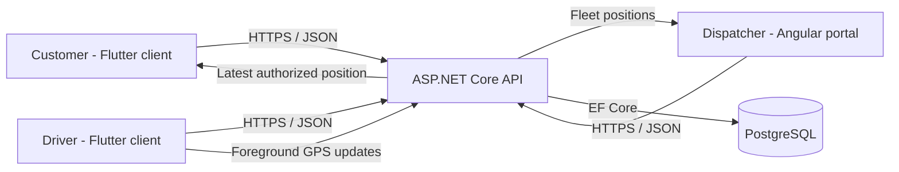
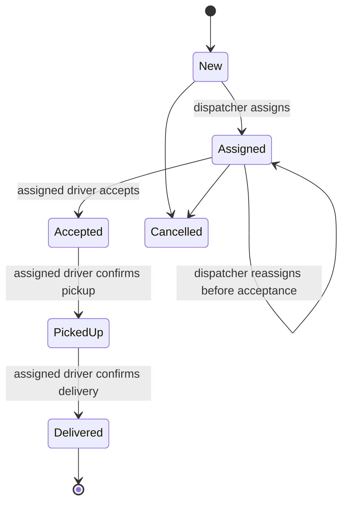

# Architecture

## Scope boundary

This repository is the first foundation for the core prototype described in the four-week action plan. It includes the ASP.NET Core API, PostgreSQL persistence, Angular dispatcher portal, Flutter customer/driver client, and foreground live-driver location. It intentionally does not add live payments, turn-by-turn routing, background GPS, messaging, POS/inventory integration, production deployment, or multi-branch behavior.

The Flutter customer and driver application is a separate client of the same API contracts. It follows Dart/Flutter conventions independently from the Angular dispatcher component structure.

## System context

## Backend boundaries

- `Domain`: entities, order-state rules, value constraints, and role/status enumerations. It has no framework or database dependency.
- `Application`: use-case services, API-facing contracts, repository ports, validation, and mappings.
- `Infrastructure`: EF Core, PostgreSQL mappings, repositories, password hashing, JWT creation, clock, and demo seeding.
- `Api`: HTTP endpoints, authorization policies, rate limiting, safe error responses, OpenAPI, health checks, and composition root.
- `UnitTests`: fast verification of the most important order invariants.

The service is a modular monolith. That is intentional: three developers can reason about and ship one deployable backend while retaining boundaries that can be extracted later only if real pilot evidence warrants it.

## Frontend boundaries

- `core/models`: TypeScript API and session contracts.
- `core/services`: HTTP access and session/error behavior.
- `core/guards`: authentication and dispatcher-role route enforcement.
- `core/interceptors`: cross-cutting authorization headers.
- `features`: page-level business capabilities such as login, queue, and order detail.
- `layout`: authenticated application chrome and navigation.
- `shared/components`: reusable presentational UI.

Every Angular component uses an external TypeScript controller, HTML template, and CSS stylesheet. Standalone components and lazy routes keep feature dependencies explicit and initial bundles small.

## Location boundary

- The driver explicitly starts and stops sharing; mobile platforms request only while-in-use permission.
- The app publishes validated latitude, longitude, accuracy, heading, speed, and capture time while the foreground stream is active.
- PostgreSQL keeps one latest-position row per driver. New updates replace it, avoiding an unbounded sensitive-location trail.
- Dispatchers can list all active drivers. Customers can read a position only for their own order, and drivers only for their assigned order.
- Clients poll every five seconds. The API classifies positions as Live (up to 15 seconds), Recent (up to one minute), or Stale.
- Public OpenStreetMap tiles are for light prototype use with visible attribution. Production must configure a suitable managed or self-hosted provider and follow its usage policy.

## Order integrity

- Prices are loaded from the server-side catalogue and totals are calculated by the API.
- `(CustomerId, IdempotencyKey)` has a unique database index, preventing duplicate order records.
- The domain entity owns allowed status transitions.
- Each status change and driver assignment creates an immutable history record.
- A dispatcher can reassign only while an order is New or Assigned.

## Security baseline

- Role policies protect customer, dispatcher, and driver endpoints.
- JWT signing keys, connection strings, and demo passwords come from environment configuration and are ignored by Git.
- Passwords use ASP.NET Core's versioned password hasher.
- Login is rate-limited and sessions expire.
- The API sends user-safe Problem Details responses with a trace ID; internal details remain in server logs.
- Order-detail access is constrained to the owning customer, assigned driver, or a dispatcher.
- Location publishing is role-protected, coordinate/time validated, and rate-limited; order-location reads reuse the order ownership boundary.
- Demo JWTs use browser session storage. A production pilot should prefer a same-origin BFF or hardened HttpOnly cookie design after threat modelling.

## Persistence policy

The baseline schema is captured in the reviewed `InitialCreate` EF Core migration. Development initialization applies pending migrations and then runs an idempotent demo seeder. Durable environments should apply reviewed migrations as a controlled deployment step and keep demo seeding disabled.
